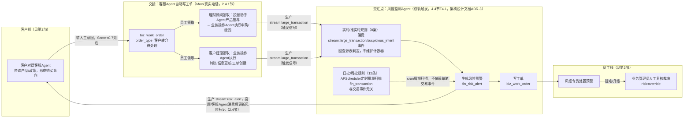
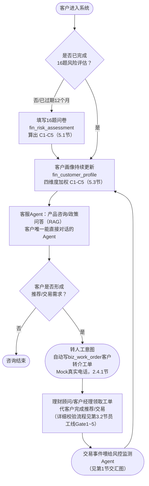
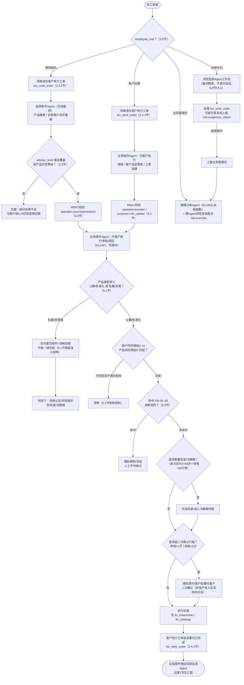
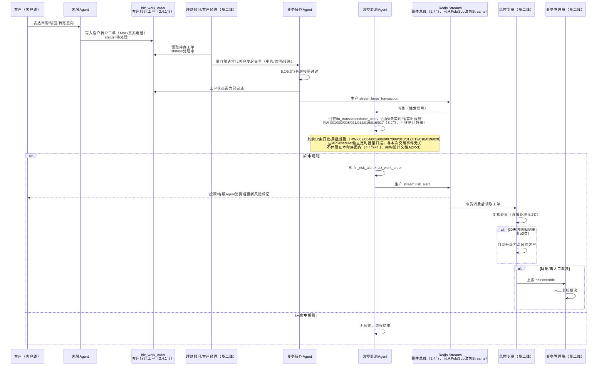

# 智能财富管家系统 — 业务流程说明

## 0. 文档说明

本文档从"客户线"与"员工线"两个视角，梳理智能财富管家系统的端到端业务逻辑，配合流程图辅助团队内部对齐与答辩讲解。规则细节（具体阈值、条款号、字段名）以《智能财富管家系统-项目需求文档.md》第3/5/6章为准，本文档只做流程可视化整理，不重复列规则原文，图中关键节点均标注对应章节，便于查证。

---

## 1. 全局视角：客户只碰1个Agent，其余全靠员工转手

**结构性事实（教师原始素材`功能设计文档.html`已明确、此前版本误读的一点）**：5个Agent里只有智能客服Agent的服务对象是客户本人；投顾助手/业务操作/风控监测/数据分析这4个全部是员工侧工具，客户不直接对话。客户"了解产品→形成购买意向→实际下单/转账"这条路，只有第一步在客服Agent里由客户自己完成，后面必须联系理财顾问或客户经理，由员工代为操作。

**"联系员工"这一步在系统里如何Mock**：项目范围明确排除真实电话/IM对接，因此不模拟真实通话，而是复用`biz_work_order`通用工单表（与风控监测Agent命中规则后写工单给风控专员处置是同一套机制）——客服Agent识别到转人工意图后自动写一条`order_type="客户转介"`的工单，员工工作台领取处理，用一条数据库记录代替"客户打电话/去网点"这个动作（详见2.4.1节）。

> 客户线的每一笔交易都是员工代为执行后被动喂给风控监测Agent，风控产生的预警又会反过来影响客户线（更新客户风险标记、投顾/客服话术）。员工线里理财顾问/客户经理服务的是"把客户意向变成实际交易"这一段，风控专员/业务管理员服务的是"交易之后的异常检测"这一段——两段职责不重叠，前者是事前执行，后者是事后审计。

---

## 2. 客户线：客户自己能做到哪一步

### 2.1 阶段说明

1. **了解阶段**：客服Agent（RAG）回答产品咨询/政策解读/FAQ，纯只读，无业务风险——**这是客户唯一能直接对话的Agent**，也是客户线在系统里独立完成的唯一一段。
2. **建档阶段**：**两套并行、互不替代的评级同时存在**，这是最容易讲混的一点：
   - `fin_risk_assessment`（风险评估）：16题问卷一次性算出 C1-C5，**12个月有效期**，是能否购买某类产品的强合规判定依据（5.1节）。
   - `fin_customer_profile`（客户画像）：四维度加权（基础属性25%+投资经验25%+风险偏好30%+行为异常20%）持续滚动更新，用于个性化推荐；其中"风险偏好"维度会把问卷得分当作输入之一，但两者可能算出不同等级，不能混为一谈（5.3节、6.1节）。
3. **交接阶段**：客户线止步于此——客服Agent无法完成的需求（产品推荐、申购/赎回、转账）触发"转人工"意图，自动写入`biz_work_order`客户转介工单（Mock真实电话，见2.4.1节），进入员工待办池，由理财顾问/客户经理领取后用自然语言指令代为操作投顾助手Agent/业务操作Agent（见第3节员工线、2.2节回调）。客户自己没有入口直接对话这两个Agent。
4. **执行结果回流**：员工代客户完成的交易写入`fin_transaction`/`fin_holdings`后，会体现在客户端的持仓/交易记录里，同时被动喂给风控监测Agent（见第1节交汇图）。
5. **画像回流**：资金变动/交易行为/市场波动/风评到期，任一触发都会反过来更新画像，形成闭环（5.3节），画像更新结果会影响下一次理财顾问给出的推荐。

### 2.2 流程图

> 原"下单五层校验"（产品类型准入→C-R匹配→FM-01~05熔断→双录/冷静期→二次确认）现已移入第3.2节员工线流程图——因为这些校验是理财顾问/客户经理在业务操作Agent里代客户操作时触发的，不是客户自己在流程图上走的步骤。

---

## 3. 员工线：客户意向如何变成一笔实际交易

### 3.1 阶段说明

员工线的核心不是"走流程"，而是"权限有多大"，由三个**互相独立、不能混用**的维度叠加决定（3.1/3.2/3.3节）：

1. **`employee_role`** 决定进哪个Agent、能干哪类事——理财顾问/客户经理/风控专员/业务管理员，四个角色非互斥，一人可兼多角色（3.2节）。
2. **`advisor_level`** 只对理财顾问生效，卡的是"能卖到哪个产品风险等级"的上限（初级R1-R2/中级R1-R3/高级R1-R5），和客户的C-R匹配是两回事，两者都要通过才放行（3.2/3.3节）。
3. **RBAC权限矩阵** 是最底层的开关（`operation:purchase`等11个业务权限字符串），决定账号有没有资格碰这个功能入口，但"能碰"不等于"能通过"业务逻辑层的资质与适当性校验（3.3节）。

理财顾问是唯一横跨两个Agent的角色：先用投顾助手Agent做只读推荐，客户确认后，**同一位理财顾问**再切到业务操作Agent代客户执行申购/赎回——"推荐"与"执行"顺序发生、职责不重叠，不能合并（见2.2节回调）。客户经理不经过投顾助手Agent，直接用业务操作Agent处理转账/信息更新/工单创建。

员工线的入口是"待办客户转介工单池"（`biz_work_order`，`order_type="客户转介"`，2.4.1节）——这是Mock真实电话/线下联系的机制，理财顾问/客户经理登录后先从这个公开待办池里领取客户意向，而不是凭空知道要服务哪个客户。

### 3.2 流程图

---

## 4. 交汇点详解：一笔预警从产生到关闭

---

## 5. 章节对照速查

| 本文档章节 | 对应需求文档章节 |
|---|---|
| 1节 客户仅直连客服Agent | 2.2节回调（服务对象矩阵） |
| 1节/2.1/3.1 客户转介工单Mock机制 | 2.4.1节、F1.3（4.1节）、6.1节`biz_work_order` |
| 2.1 建档阶段（两套C1-C5） | 5.1节、5.3节、6.1节 |
| 2.1 客户线止步于交接 | 2.2节回调、4.3节F3.4 |
| 3.2 领取待办工单 | 2.4.1节 |
| 3.2 下单五层校验（移入员工线） | 5.1节（两层准入结构、拒绝规则、双录冷静期）、5.3节（FM-01~05） |
| 2节 画像回流机制 | 5.3节画像更新机制 |
| 3节 三维度权限叠加 | 3.1、3.2、3.3、3.4节 |
| 3.1 理财顾问横跨两个Agent | 2.2节回调、3.2节回调 |
| 4节 风控闭环 | 2.4节（事件总线）、4.4节F4.1、5.2节（规则/优先级/误报处理） |

---

## 6. 变更记录

| 日期 | 变更内容 | 变更人 |
|---|---|---|
| 2026-08-13 | 首版发布 | （待填） |
| 2026-08-13 | 修正Agent访问边界：投顾助手/业务操作Agent的服务对象均为员工（理财顾问/客户经理），客户不直接对话，仅通过客服Agent咨询后线下联系员工代办；相应重画客户线/员工线流程图与交汇点时序图，原"下单五层校验"从客户线移入员工线 | （待填） |
| 2026-08-13 | 补充"客户-员工转介"的Mock实现机制：复用`biz_work_order`表新增`order_type="客户转介"`，客服Agent识别转人工意图后自动写工单，员工从待办池领取处理，代替真实电话/线下联系；三张流程图与需求文档2.4.1节同步补充 | （待填） |
| 2026-08-13 | 修正风控监测Agent的触发路径：全局流程图与交汇点时序图此前只画出"交易事件→风控Agent匹配20条规则"单一路径，遗漏了15条日批/周批规则由APScheduler独立定时批量扫描（与事件流无关）这条路径；同步把残留的Pub/Sub时代命名"event:risk_alert 广播"改为"生产 stream:risk_alert（消费）"，与需求文档2.4节、《架构设计文档.md》ADR-3对齐 | （待填） |
| 2026-08-13 | 修正规则轨道口径与计数错误：全局流程图"实时/准实时规则（5条）"改为"（8条）"、"日批/周批规则（15条）"改为"（12条）"；交汇点时序图规则清单从"RW-001/003/008/016/017"改为"RW-001/003/008/011/014/015/016/017"，并修正此前"其余15条"清单实际只列出13个编号、遗漏RW-014/015的计数错误，改为准确的12条清单，与需求文档、《架构设计文档.md》ADR-3、《Agent设计文档.md》同步 | （待填） |
