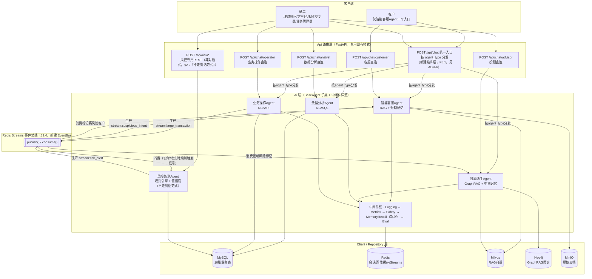
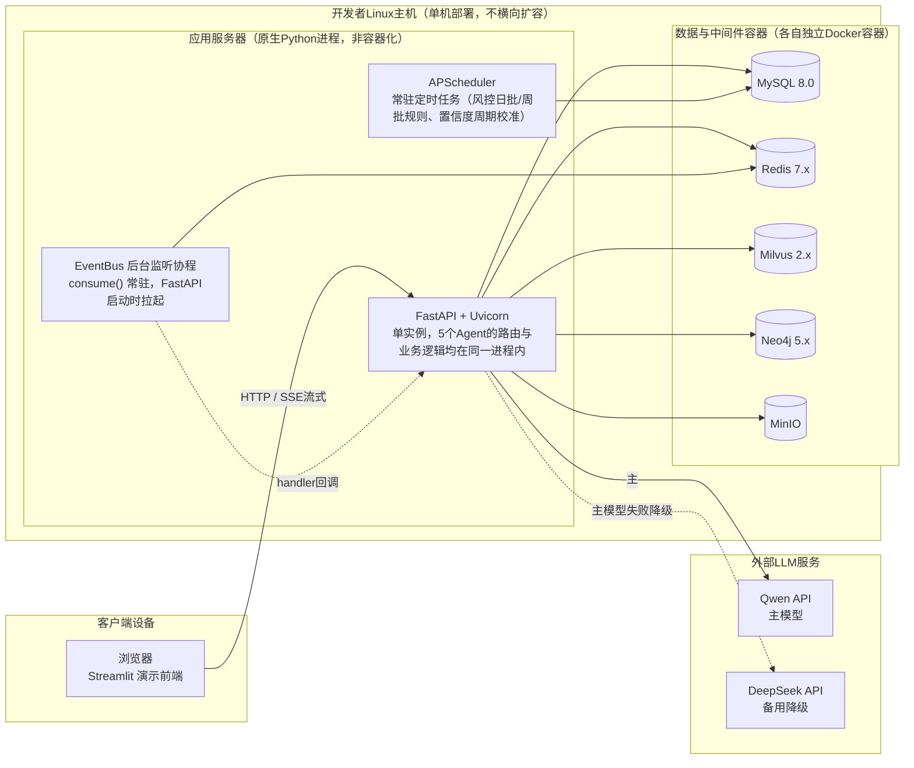
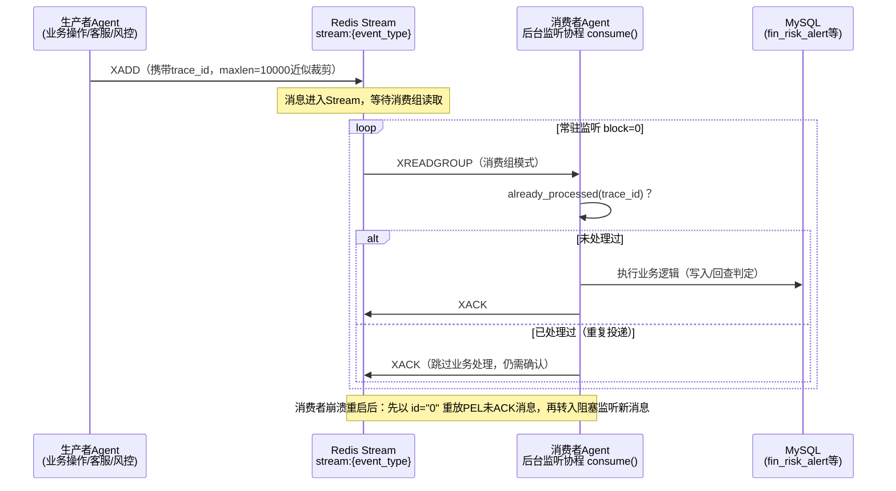
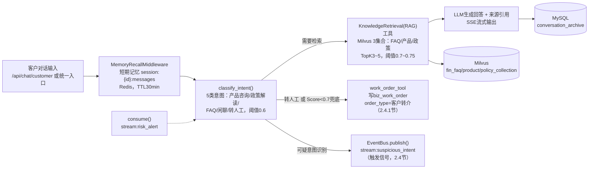
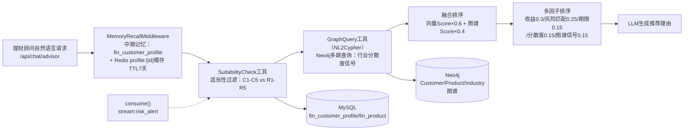
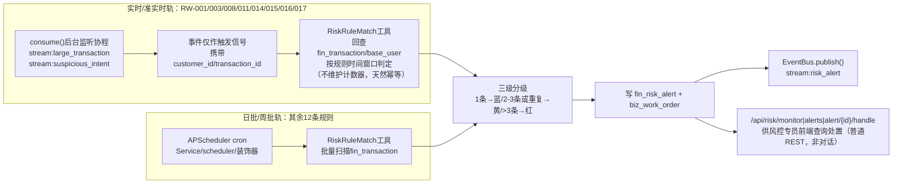
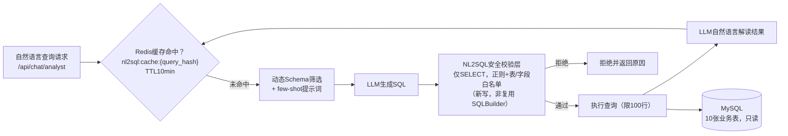
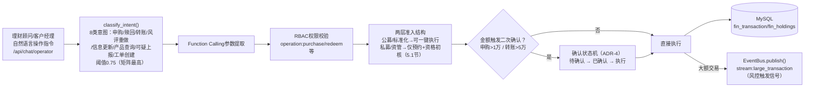

# 智能财富管家系统 — 架构设计文档

## 0. 文档说明

本文档是《智能财富管家系统-项目需求文档.md》第2章"总体架构设计"的可视化与决策记录补充，**不是第二个信息源**：凡是需求文档已有的条款（Agent矩阵、RBAC矩阵、事件消息格式、非功能指标等具体数值），本文档一律交叉引用章节号，不重复抄录；本文档新增的内容只有两类——① 需求文档里没有的**架构图**（逻辑架构、部署视图、技术层时序图），② 把散落在需求文档各处的"设计取舍"段落集中整理成条目化的**架构决策记录（ADR）**。

如果本文档与需求文档正文出现措辞不一致，以需求文档为准，并视为本文档需要同步更新的信号。

**读者**：答辩PPT的架构图环节、团队内部技术对齐、后续表设计/API接口文档的架构基线。

---

## 1. 架构目标与设计原则

4天工期（见需求文档1.5/8.5节）是本项目所有架构决策的第一约束条件，四条原则贯穿全文：

1. **能复用绝不重写**：脚手架（`D:\lqh\reproject\ric-train\ric-train\Base`）已验证可用的分层、Agent基座、中间件、DB客户端、RBAC，一律直接复用，architecture 上不做"看起来更优雅但要重新实现"的选择（例：不为5个Agent引入独立微服务拆分，仍是同一FastAPI进程内的多个Agent子类）。
2. **单体不过度设计**：不为不存在的横向扩容需求引入复杂度（例：Streams消费组不做多实例竞争消费的`XAUTOCLAIM`，因为部署模型就是单进程单消费者，见第3节）。
3. **演示优先，兼顾真实性**：架构必须支撑答辩要求的端到端演示（RAG/GraphRAG/NL2SQL/NL2API四类场景连续演示，见答辩须知），因此关键路径（多Agent协作编排、事件总线、风控规则引擎）的完整性优先于覆盖度。
4. **决策要可追溯**：凡是"没有按教学素材原始设计做"的地方（Pub/Sub改Streams、风控双轨触发等），都要留痕说明背景和理由，避免答辩被追问"为什么这样设计"时答不上来——这正是第5节ADR的作用。

---

## 2. 逻辑架构图

对应需求文档§2.1文字描述的可视化，分层关系不变（Api→Service→Ai→Client/Repository→Models），本图额外画出5个Agent与事件总线的连接关系（对应§2.2/§2.4）：

**与需求文档的关系**：Agent职责/服务对象/触发方式的具体文字定义见§2.2；EventBus的`publish()`/`consume()`实现代码见§2.4；中间件改造点（新增`MemoryRecallMiddleware`）见§2.3；统一入口与直连路由的完整清单见§7.1；编排层的落地方式见ADR-6。

**统一入口 vs 直连路由**：`POST /api/chat`统一入口按请求体里的`agent_type`字段分发到对应Agent，是F5.1要求新建的"编排层"在架构图上的落地；`/api/chat/{customer|advisor|analyst|operator}`是同时保留的直连路由，两者最终都调用同一个Agent实例，只是省去手动传`agent_type`的步骤，便于演示/测试时直接对着某个Agent发请求。风控监测Agent不提供对话入口（§2.2"不走对话范式"），只有`/api/risk/*`这组普通REST接口。

### 2.1 代码目录落点：非MySQL数据库与前端

第2节架构图里的"Client/Repository层"对不同数据库的抽象程度并不一致——只有MySQL和Milvus在`Client`之上还有一层ORM/VDB抽象（`Repository/`），Neo4j/Redis/MinIO在脚手架里都是直接用`Client`层薄封装，没有额外的Repository抽象。为避免团队开发时对"新代码放哪个文件"产生分歧，明确如下：

| 数据库 | Client（脚手架已提供） | ORM/抽象层 | 本项目新增代码位置 |
|---|---|---|---|
| MySQL | `Client/mysqlClient.py` | `Repository/base/baseDBModel.py`（`BaseDBModel`） | 10张业务表Model：`Repository/models/`（或`Models/`） |
| Milvus | `Client/milvusClient.py` | `Repository/base/baseVDB.py`+`baseVDBConnection.py`（`BaseVDBModel`） | 3个集合（FAQ/产品/政策）Model：`Repository/models/`，仿`Repository/examples/exampleVDBModel.py`写法 |
| Neo4j | `Client/neo4jClient.py` | 无ORM，直接封装 | 图谱写入沿用`Service/neo4jService.py`扩展；查询方向的Cypher生成Agent放`Ai/agents/`，两者都直接调`neo4jClient.run(cypher, parameters)`，不新建ORM层 |
| Redis | `Client/redisClient.py`+`RicUtils/redisUtils.py` | 无ORM，直接调用 | 会话/画像缓存直接用现成封装；EventBus（Streams的`publish()`/`consume()`封装）新建`Client/eventBusClient.py`，与其余Client文件并列（脚手架惯例是一个外部系统对应一个Client文件），不塞进Repository或Service |
| MinIO | `Client/minioClient.py` | 无ORM，直接调用 | 知识库原始文件上传/下载，新建`Service/knowledgeService.py`直接调用 |

**前端代码**：复用脚手架已预留的`Frontend/`目录（`Api/authApi.py`里已有`FRONTEND_DIR`引用指向该目录），新增`Frontend/streamlit_app.py`作为Streamlit演示前端入口，与现有静态HTML demo（`auth_verify.html`/`superpowers.html`）共存不冲突。Streamlit进程与FastAPI后端解耦、独立启动（`streamlit run Frontend/streamlit_app.py`），经HTTP/SSE调用后端接口，对应本节架构图与§3部署视图里"浏览器"到"Uvicorn"的那条箭头。

---

## 3. 部署视图

物理部署拓扑，明确"单进程、单消费者、不横向扩容"这一贯穿全文的部署假设（该假设是§2.4"为什么Streams消费组不需要`XAUTOCLAIM`"的前提，见ADR-2）。**实际部署环境**：应用服务器（FastAPI/Uvicorn）以原生Python进程运行，MySQL/Redis/Milvus/Neo4j/MinIO这5个数据与中间件组件各自以独立Docker容器方式运行——两者同机部署在同一台开发者Linux主机上，容器只承载有状态的数据层，不做应用层容器化（详见需求文档§2.5"部署形态说明"）：

**明确排除**（与需求文档§1.3 Out of Scope一致）：不部署多实例/负载均衡、不做生产级容灾、不对接真实IM/电话/支付通道。若未来确需横向扩容多个Agent进程，Streams消费组需要补充`XAUTOCLAIM`处理消费者假死场景——这是当前架构明确未覆盖的扩展点，不在4天交付范围内。

---

## 4. 技术层时序图：事件总线通用交互模式

《业务流程说明.md》§4"交汇点详解：一笔预警从产生到关闭"已经画出了**业务视角**的完整时序图（客户操作→风控预警→投顾/客服联动的具体业务场景），本节不重复该图，而是补充一张**技术层视角**的通用交互图——展示`stream:risk_alert`/`stream:large_transaction`/`stream:suspicious_intent`这3类事件共享的同一套生产-消费技术模式（对应§2.4的`EventBus.publish()`/`consume()`实现）：

**与业务流程说明.md的分工**：该文档回答"这个具体业务场景里谁在什么时候做了什么"；本图回答"任意一类事件在技术上是怎么被可靠处理的"——两者是业务视角与技术视角的互补，不是重复。

---

## 5. 架构决策记录（ADR）

把需求文档正文里散落的"设计取舍"段落集中整理成条目化记录，每条格式统一为：背景 / 决策 / 理由（含被否决的备选方案）/ 需求文档对应章节。

### ADR-1：复用脚手架分层架构，而非重新设计

- **背景**：老师原始素材（`需求文档.html`/`功能设计文档.html`）描述的是理想化的独立架构，未考虑现有脚手架的既有实现。
- **决策**：沿用脚手架`Api→Service→Ai→Client/Repository→Models`分层，5个Agent均作为`BaseAgent`子类接入既有中间件链路，不另起一套架构。
- **理由**：4天工期下重新设计分层架构的收益（架构"更贴合教学素材原意"）远低于成本（要重新实现DB连接池、认证、日志等已验证可用的基础设施）；脚手架分层与教学素材的诉求（骨架统一、策略可插拔）本质吻合，改造成本可控。备选方案"完全独立新建后端"因工期不可行被否决。
- **对应章节**：需求文档§2.1、§2.3、§2.7（复用/新建判断的代码核实依据）。

### ADR-2：跨Agent事件总线由 Redis Pub/Sub 改为 Redis Streams

- **背景**：老师原始素材建议用Redis Pub/Sub解耦Agent间通信。Pub/Sub是fire-and-forget，只保证"发布"不保证"送达和处理成功"。
- **决策**：全部3类跨Agent事件（`risk_alert`/`large_transaction`/`suspicious_intent`）改用Redis Streams消费组模式，Pub/Sub完全弃用；封装为共享`EventBus`工具类供各Agent负责人复用；按**单消费者、不横向扩容**的部署模型设计，不引入`XAUTOCLAIM`等竞争消费复杂度。
- **理由**：项目里3类事件全部是驱动下游业务逻辑的必须处理任务，不是可丢弃的UI提醒，也没有真正需要低延迟推送的场景（工作台待办列表本来就是登录后查询`biz_work_order`，见2.4.1节）；团队分工合作的开发模式下，一套统一的`EventBus`封装比"每类事件各自设计可靠性方案"更适合多人协作、减少每人各自理解Streams细节的成本。备选方案"保留Pub/Sub + 落库补偿扫描"因需要为`risk_alert`单独设计MySQL补偿表和定时扫描逻辑、复杂度不降反升而被否决。
- **对应章节**：需求文档§2.4（含完整`EventBus`代码）、§2.5（技术栈选型Redis用途）、§2.6（架构改动清单）、§7.3（事件消息格式）。

### ADR-3：风控监测Agent双轨触发（事件驱动 + 定时批量扫描）

- **背景**：最初把风控Agent的触发方式笼统写成"被动触发（交易事件流）"，即全部20条反洗钱规则（RW-001~020）都挂在事件流上触发。复查规则表发现有8条（RW-001/003/008/011/014/015/016/017）是"实时/准实时"，其余12条明确标注"日批/周批"——本质是"N日/N周内累计"型的时间窗口批量判定，不适合逐笔事件触发。（此前曾误将RW-011/014/015遗漏出"实时/准实时"清单归入日批/周批，经核实两点后予以修正：一是需求文档§5.2规则表本身已把这3条标注为实时/准实时，二是这3条所需数据——`counterparty_region`/`payer_account_name`/`base_user.updated_at`——均已在现有表结构中，不需要为此扩展事件payload。）
- **决策**：拆成两条独立触发路径——实时/准实时规则由消费`stream:large_transaction`/`stream:suspicious_intent`事件触发，事件仅作触发信号，Agent收到后直接回查`fin_transaction`等源表按规则窗口判定，**不维护派生的Redis计数器状态**；日批/周批规则完全脱离事件流，由`Service/scheduler/`的APScheduler装饰器按cron周期直接批量扫描源表。
- **理由**：规则语义本身就是"按时间窗口回source表统计"而非"实时累加"，维护计数器既不必要（`fin_transaction`已是权威数据源）又引入额外的幂等性风险（消息级`trace_id`去重防不住计数器状态漂移，而"无状态回查"天然幂等，重复触发也不会得出错误结果）。这一区分也与`event:risk_alert`场景"以数据库表为权威来源，事件只是触发信号"的既有模式保持一致。
- **对应章节**：需求文档§2.2（触发方式矩阵）、§2.4（事件消费描述）、§4.4/F4.1（描述与验收标准）、§5.2（RW-001~020规则表的频率标注）。

### ADR-4：新建"待确认→已确认→执行"二次确认状态机

- **背景**：脚手架`SafetyMiddleware`只有"通过/阻断/脱敏"三态，没有"人机协同二次确认"能力；但业务操作Agent（申购>1万、转账>5万）必须支持"AI生成操作建议→人工确认→AI执行"这一交互模式，不能由AI单方面直接执行大额写操作。
- **决策**：在`SafetyMiddleware`基础上新增确认状态机，覆盖"待确认→已确认→执行"三态，而不是复用现有的"通过/阻断"二元判断硬凑。
- **理由**：二次确认与"阻断"语义不同——阻断是拒绝执行，二次确认是"生成方案但暂缓执行，等待人工明确同意后才真正执行"，两者对应的后续动作和状态流转完全不同，无法用现有二元状态表达；这也是CONTEXT.md领域词典里"业务操作建议"（不代表交易已执行）这一概念在架构层面的落地。
- **对应章节**：需求文档§8.2（NL2API二次确认要求）、§4.3/F3.4（业务操作Agent验收标准）。

### ADR-5：客户-员工转介机制复用`biz_work_order`表，不新建IM/电话对接

- **背景**：客户只能直接对话智能客服Agent，投顾助手/业务操作Agent均由理财顾问/客户经理代客户操作；真实业务里这一步靠客户打电话/到网点完成，但项目范围明确排除真实IM/电话对接（§1.3 Out of Scope）。
- **决策**：不新建平行的"转介"机制，复用`biz_work_order`通用工单表 + `work_order_tool`工具外壳，新增`order_type="客户转介"`取值；客服Agent识别到转人工意图后自动写入待处理工单，理财顾问/客户经理从公开待办池领取，Mock"接上员工"这一动作。
- **理由**：这与F4.1风控监测Agent命中规则后写`biz_work_order`供风控专员处置是完全相同的模式，不算新增架构，只是多一种`order_type`；素材中没有客户与员工的固定归属关系数据，"公开待办池、任一符合角色的员工均可领取"是唯一站得住脚的实现方式，不做"专属客户经理"精准分配。
- **对应章节**：需求文档§2.4.1（完整机制说明）、§3.2（角色对应关系）。

### ADR-6：编排层做轻量请求分发，不引入多跳Agent间编排框架

- **背景**：脚手架现状是5个独立单体Agent，没有supervisor/路由/通信机制（F5.1）；业界常见的multi-agent编排框架（如LangGraph的supervisor模式）支持Agent间多跳调用、动态转交对话。需要确定本项目的"编排层"具体要做到哪一步。
- **决策**：编排层只做**请求进入时的一次性分发**——`POST /api/chat`读取`agent_type`字段，选择对应Agent实例处理这一次请求，不引入Agent间互相调用、动态转交、多跳编排的能力。
- **理由**：本系统里5个Agent之间从来不存在"A处理到一半把对话转交给B继续"的场景——Agent间协作只有两种既有模式：①异步事件总线通知（ADR-2，如风控预警推送给投顾/客服），②人工切换账号触发不同Agent（如理财顾问先用投顾助手Agent推荐、客户确认后同一个人再切到业务操作Agent执行，见§3.2），两种模式都不需要Agent运行时互相调用。引入LangGraph式的supervisor编排框架会带来不必要的学习成本和运行时复杂度，与ADR-1"不过度设计"的原则冲突，故不采用；备选的"每个Agent互相持有其他Agent引用、直接函数调用"方案因为破坏了"Agent间只能通过事件总线解耦"这一既定原则（§2.4）而被否决。
- **对应章节**：需求文档§4.5/F5.1（多Agent协作验收标准）、§7.1（REST API清单）。

---

## 6. 安全与合规架构

架构层面如何把RBAC、熔断规则、脱敏、二次确认这几类安全/合规能力串联起来（具体条款见需求文档对应章节，本节只讲架构串联方式，不重复条款数值）：

- **身份与权限**：JWT登录 + RBAC角色（理财顾问/客户经理/风控专员/业务管理员，允许多角色叠加）→ 业务操作Agent的每个Function Calling工具调用前做权限校验，权限标识与角色映射见§3.3。
- **事前熔断（同步，阻断式）**：FM-01~05（§5.3）在客户画像/交易发起的同步路径内校验，一旦命中直接限制或拒绝，不经过事件总线，不影响后续判断的实时性。
- **事中二次确认（同步，人机协同）**：ADR-4的状态机，在业务操作Agent的同步request-response路径内，是客户/员工感知延迟的唯一环节。
- **事后异常监测（异步，被动触发）**：RW-001~020反洗钱规则（§5.2），走ADR-3的双轨触发，不阻塞交易本身完成——这是"客户交易本身低延迟"与"风控事件总线异步处理"两者不矛盾的架构依据：两条路径完全独立，事件总线的消费延迟不会传导到客户端。
- **数据脱敏**：`SafetyMiddleware`的`PIIMasker`统一在中间件层生效（对话归档、日志、SSE输出、前端展示），API内部调用之间传递原始数据，脱敏只发生在"离开系统边界"的这几个出口，具体字段规则见§8.4。
- **统一合规阈值**：`COMPLIANCE_THRESHOLDS`配置集中管理跨模块共享的金额/次数阈值（§8.2），避免二次确认、反洗钱报告线、适当性双录触发这三处各自硬编码导致的不一致。

---

## 7. 非功能性架构考量

具体指标数值见需求文档§8.1/§8.3，本节只讲架构层面用什么手段去满足这些指标：

- **超时降级链路**：Milvus/Neo4j/LLM调用均设超时阈值，超时后走§8.3定义的降级路径（MySQL LIKE兜底/跳过图谱增强/切备用模型），降级逻辑内置在对应Service层，不需要额外的架构组件。
- **Redis故障降级**：中间件层的Cache-Aside模式失效时直连MySQL，恢复后自动回填，不引入额外的熔断器组件（4天工期下没必要）。
- **事件总线内存增长控制**：`EventBus.publish()`用`maxlen=10_000, approximate=True`做近似裁剪（§2.4），避免联调期间Stream无限增长占用Redis内存——这是当前唯一需要主动防护的资源增长点，因为其余组件（MySQL/Milvus/Neo4j）都有自身的持久化和容量管理，不需要项目层面额外处理。
- **扩展性边界（明确不做）**：不支持多进程/多实例横向扩容（ADR-2的部署假设前提）、不支持生产级容灾、不支持真实IM/支付通道对接——这些都是§1.3 Out of Scope的直接架构后果，答辩被问及"如何扩容"时应如实说明当前架构的边界，而非临场设计一个未经验证的扩容方案。

---

## 8. 五个Agent内部技术架构

第2节逻辑架构图把5个Agent画成同一层级的5个方框，本节对每个方框做内部展开——组件构成、数据流向、输入输出，对应需求文档§2.2职责矩阵、§2.3执行骨架、§4.1~4.4各Phase功能说明、§7.2内部Tool清单已有的文字定义，本节不新增设计结论，只做可视化整理。5张图共享同一个骨架背景：`BaseAgent`统一构造`llm/tools/memory/middlewares`，中间件洋葱`Logging→Metrics→Safety→MemoryRecall（新增）→Eval`（见§2.3），子类各自实现`classify_intent()`/`_get_handler()`/`_intent_threshold()`/`_scenario_name()`四个方法；风控监测Agent是唯一例外，不走这套对话骨架（见8.3节）。

### 8.1 智能客服Agent（RAG + 短期记忆）

- 【复用】`ReActAgent`基座 + Milvus检索工具外壳；【新写】5类意图分类逻辑、Score<0.7兜底转人工策略、"客户转介"工单写入触发时机（F1.3，需求文档§4.1）。

### 8.2 投顾助手Agent（GraphRAG + 中期记忆）

- 【复用】`ReActAgent`基座；【新写】GraphQuery查询逻辑（`nl2cypherAgent.py`方向相反，需参照其ReAct双工具模式重写为查询方向）、融合排序与多因子排序核心逻辑（F3.3，需求文档§4.3）。

### 8.3 风控监测Agent（规则引擎 + 置信度，不走对话范式）

- 风控Agent不实例化为`ReActAgent`对话骨架，`rule.evaluate()`是确定性代码判断（返回True/False），不存在"意图分类置信度"这个概念（见《待确认疑点补充设计建议.md》疑点3）；两条触发轨道的完整设计依据见ADR-3。

### 8.4 数据分析Agent（NL2SQL）

- 触发方式是单一路径而非5类意图分类，`_intent_threshold()`取0.5（矩阵中最低，内部只读查询出错不造成业务后果，见§2.3）；安全校验层是本Agent的核心新写工作量（F2.3，需求文档§4.2）。

### 8.5 业务操作Agent（NL2API）

- 【工具外壳复用】`BaseTool.to_openai_schema()`可作8个工具外壳；【新写】二次确认状态机（`SafetyMiddleware`原仅"通过/阻断"二态，扩展方案见ADR-4）、两层准入结构判断逻辑（F3.4，需求文档§4.3）。

---

## 9. 变更记录

| 日期 | 变更内容 | 变更人 |
|---|---|---|
| 2026-08-13 | 首版发布，从需求文档§2章及各处"设计取舍"段落提炼出逻辑架构图、部署视图、技术层时序图、5条ADR、安全架构串联说明、非功能性架构考量 | （待填） |
| 2026-08-13 | 修正逻辑架构图遗漏的统一路由/编排层（F5.1）：补充`POST /api/chat`分发节点，修正Api层路由命名与§7.1对齐，纠正风控Agent被误画出对话入口的问题；新增ADR-6说明编排层只做请求进入时的一次性分发、不引入多跳Agent编排框架 | （待填） |
| 2026-08-13 | 新增第8节"五个Agent内部技术架构"：为5个Agent各画一张内部组件流程图（记忆/意图分类/核心工具链/数据存储/事件生产消费），原第8节"变更记录"顺移为第9节 | （待填） |
| 2026-08-13 | 修正ADR-3/§8.3的规则轨道划分口径：此前"5条实时/准实时+15条日批/周批"遗漏了需求文档§5.2本身已标注为实时/准实时的RW-011/014/015，核实所需字段（`counterparty_region`/`payer_account_name`/`base_user.updated_at`）均已存在于现有表结构后，改为"8条实时/准实时+12条日批/周批"，与需求文档、《业务流程说明.md》、《Agent设计文档.md》同步 | （待填） |
| 2026-08-13 | 补充实际部署环境细节：§3部署视图此前"数据与中间件容器"只是泛称，未点明实际运行方式；明确MySQL/Redis/Milvus/Neo4j/MinIO以独立Docker容器运行、FastAPI应用以原生Python进程运行，两者同机部署在开发者Linux主机上，部署拓扑图相应补充"开发者Linux主机"外层分组；与需求文档§2.5新增的"部署形态说明"同步 | （待填） |
| 2026-08-13 | 新增§2.1"代码目录落点"：明确Milvus/Neo4j/Redis/MinIO这4类非MySQL数据库在脚手架中的Client/ORM归属与本项目新增代码的具体文件位置（EventBus封装落在`Client/eventBusClient.py`），以及前端代码复用脚手架`Frontend/`目录、新增`Frontend/streamlit_app.py`作为Streamlit入口；同步演示前端技术选型从"Streamlit/Gradio"敲定为Streamlit，§3部署视图拓扑图文字同步修正 | （待填） |
